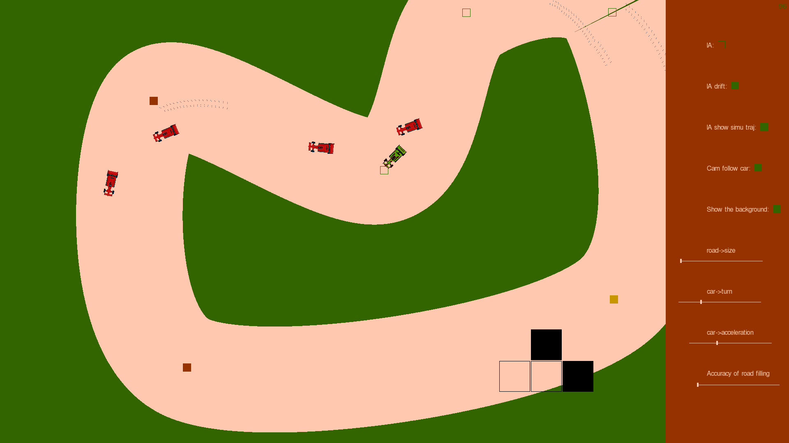

# voiture

Car game with splines, camera, collision, AI etc.

Old version demo: https://youtu.be/qXShaxG2h3Y



** **  

Request SDL2  

Install on Ubuntu:

```
sudo apt-get install libsdl2-2.0-0 libsdl2-gfx-1.0-0 libsdl2-image-2.0-0 libsdl2-mixer-2.0-0 libsdl2-net-2.0-0 libsdl2-ttf-dev
```

Install on Arch:

```
sudo pacman -S sdl2 sdl2_image sdl2_ttf
```

** **
Install repo
```
git clone https://github.com/Helazior/voiture.git
cd voiture
mkdir obj
```

** **  

# Compiler

```
make
```

# Run

```
make run
```

with gcc -O3 optimisations :

```
make opti
```

debug mode :

```
make debug
```

valgrind mode :

```
make valgrind
```

